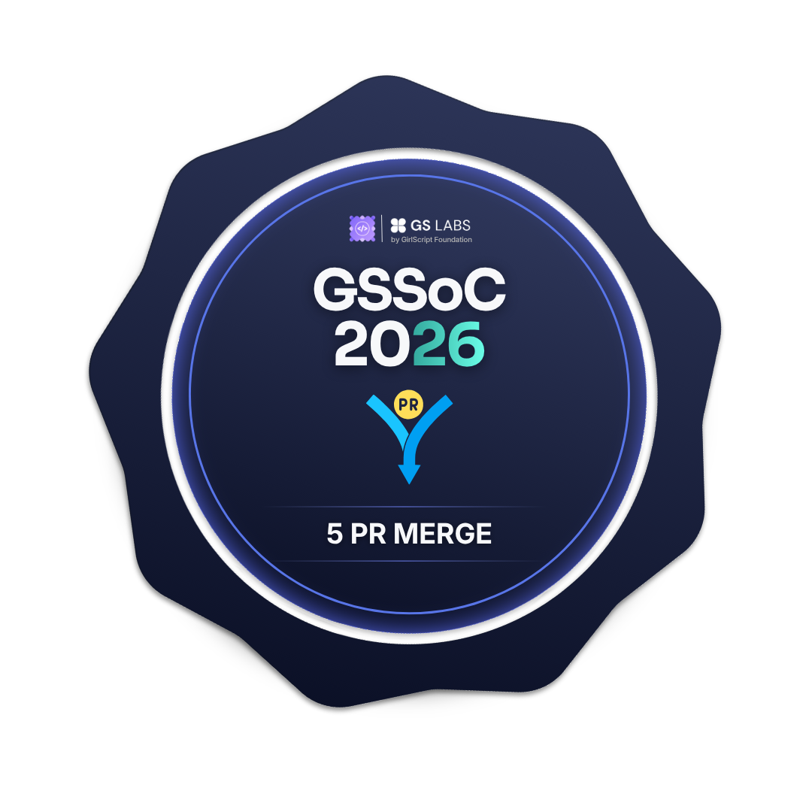
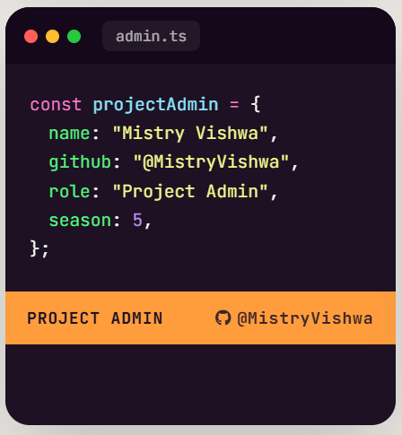

  

<!-- <h1 align="center">Hi 👋, I'm Vishwa Mistry</h1>
<h3 align="center">WordPress & PHP Web Developer | MCA Student | AI & GenAI Explorer</h3> -->

---

  
  
  

---

### 👤 About Me

I am a **WordPress & PHP Web Developer** with 2+ years of hands-on experience in building scalable, responsive, and high-performance websites. My expertise includes **custom WordPress theme development, custom plugin development, WooCommerce solutions, Elementor customization, website maintenance, performance optimization, bug fixing, and responsive UI implementation**.

I enjoy developing clean, maintainable, and user-focused web applications using **PHP, MySQL, JavaScript, HTML, CSS, Bootstrap, and modern web development practices**. I am passionate about writing efficient code, solving real-world problems, and continuously improving website performance and user experience.

Currently, I am pursuing a **Master of Computer Applications (MCA)** at **Parul University**, where I am expanding my knowledge in **Artificial Intelligence, Generative AI, AI Agents, SaaS application development, automation tools, APIs, and full-stack web technologies**.

I actively contribute to **open-source projects** through programs like **GirlScript Summer of Code (GSSoC)** and **Nexus Spring of Code**, where I collaborate with developers, contribute meaningful features and bug fixes, review code, and strengthen my software engineering skills.

I always learn emerging technologies, contribute to impactful projects, and build innovative digital solutions that combine modern web development with AI-powered experiences.

---

### 🛠 Tech Stack

  
  
  
  
  
  
  
  
  
  
  
  
  

---

## 💼 Experience

### Project Admin — Social Summer of Code (SSOC)

📅 **June 2026 – Present**

- Managing assigned open-source projects.
- Reviewing contributor pull requests.
- Guiding contributors throughout the program.
- Coordinating issue assignments and project progress.
- Supporting maintainers and ensuring smooth collaboration.

────────────────────────────────────────────────────────────────────────────────

### Open Source Contributor — GirlScript Summer of Code 2026 (GSSoC'26)

📅 **May 2026 – Present**

- Selected as an Open Source Contributor.
- Contributing features, bug fixes and documentation improvements.
- Collaborating with mentors, maintainers and developers.
- Working with Git, GitHub, Pull Requests and Issue Tracking.
- Improving software engineering and open-source collaboration skills.

────────────────────────────────────────────────────────────────────────────────

### Jr. Web Developer — Sanghvi Technosoft
📅 **Oct 2023 – Present**

- Developing custom WordPress websites and PHP websites.
- Optimizing website performance, security and SEO.
- Custom website development, Elementor customization, WooCommerce, website maintenance, responsive design, and performance optimization.

────────────────────────────────────────────────────────────────────────────────

### Open Source Contributor — Nexus Spring of Code (NSoC)

📅 **Apr 2026 – Jun 2026**

- Selected as an Open Source Contributor.
- Worked on real-world GitHub repositories.
- Implemented feature enhancements and bug fixes.
- Collaborated with project maintainers and contributors.
- Strengthened development workflow and version control skills.

────────────────────────────────────────────────────────────────────────────────

### PHP Web Developer Trainee — CMSWebServices

📅 **Jun 2023 – Oct 2023**

- Completed intensive training in **HTML5, CSS3, Core PHP, WordPress (Frontend), JavaScript, and MySQL**.
- Built responsive and user-friendly web pages using modern web development practices.
- Worked on multiple **WordPress website projects**, including theme customization and website maintenance.
- Assisted in fixing bugs, implementing new features, and improving website performance.
- Gained hands-on experience with **Git**, debugging, and collaborative development workflows.
- Successfully completed all assigned tasks and projects under the guidance of senior developers.

────────────────────────────────────────────────────────────────────────────────

### Python Developer Intern — BrainyBeam Technologies

📅 **Jun 2022 – Jan 2023**

- Learned **Python programming**, HTML5, CSS3, JavaScript fundamentals, and basic web development concepts.
- Built an **E-Commerce Website** as the major internship project using Python and web technologies.
- Worked with Python fundamentals including file handling, functions, object-oriented programming, and basic database connectivity.
- Developed responsive user interfaces using HTML, CSS, and Bootstrap.
- Strengthened problem-solving, debugging, and software development skills through practical assignments.
- This internship laid the foundation for my college academic projects in web development.

---

## 🚀 Open Source Contributions & Achievements

I actively participate in Open Source programs by contributing to real-world GitHub repositories, collaborating with maintainers and developers, resolving bugs, implementing new features, improving documentation, and strengthening my software engineering skills through community-driven development.

### GirlScript Summer of Code 2026 (GSSoC'26)

**Role:** Open Source Contributor

📅 **May 2026 – Present**

GirlScript Summer of Code (GSSoC) is one of India's largest open-source programs that provides contributors with the opportunity to work on real-world projects under the guidance of experienced mentors and maintainers.
- Contributed to real-world open-source repositories.
- Developed new features and enhancements.
- Fixed bugs and resolved GitHub issues.
- Improved project documentation.
- Worked with Git, GitHub, Pull Requests, and Issue Tracking.
- Collaborated with project maintainers and fellow contributors.

🔗 **Profile:**  
https://gssoc.girlscript.org/profile/f38025f9-6788-4274-8cf6-eedf2879b505

────────────────────────────────────────────────────────────────────────────────

### Nexus Spring of Code (NSoC)

**Role:** Open Source Contributor

📅 **Apr 2026 – Jun 2026**

Nexus Spring of Code (NSoC) is an open-source initiative focused on encouraging developers to contribute to impactful software projects while learning collaborative development practices.
- Contributed to multiple GitHub repositories.
- Implemented new features and enhancements.
- Fixed bugs and improved project quality.
- Participated in issue discussions and code reviews.
- Worked extensively with Git, GitHub, branches, and pull requests.
- Collaborated with project maintainers and contributors.
- Improved problem-solving and software engineering skills.

  

</a>

🔗 **Profile:** 
https://www.nsoc.in/leaderboard

────────────────────────────────────────────────────────────────────────────────

### Social Summer of Code (SSOC)

**Role:** Project Admin

📅 **2026 – Present**

As a Project Admin at Social Summer of Code (SSOC), I support the open-source community by managing projects and mentoring contributors.
- Managing assigned open-source repositories.
- Reviewing Pull Requests and contributions.
- Guiding contributors throughout the program.
- Assigning issues and maintaining project workflows.
- Collaborating with maintainers and organizers.
- Ensuring smooth project progress and code quality.

<!-- 

 -->

---

## 🏅 Open Source Highlights

- 🌸 Open Source Contributor — GirlScript Summer of Code 2026 (GSSoC'26)
- 🚀 Open Source Contributor — Nexus Spring of Code (NSoC)
- 🛡️ Project Admin — Social Summer of Code (SSOC)
- 💻 Active contributor to real-world GitHub repositories.
- 🐛 Experience in bug fixing, feature development, and documentation improvements.
- 🤝 Collaborated with maintainers, mentors, and contributors across multiple Open Source communities.
- ⚡ Strong understanding of Git, GitHub, Pull Requests, Issues, and collaborative development workflows.
  
---

### 📊 GitHub Analytics

  <!--  -->
  

  
  

  
  

  

---

## 💻 Currently Learning

- 🤖 Generative AI (GenAI)
- 🧠 AI Agents Development
- 💻 AI-Powered Applications
- ⚡ AI Tools & Automation
- ✨ Prompt Engineering
- 🌐 Full-Stack Web Development
- ☁️ Cloud Computing (AWS & Azure Basics)
- 🔒 Web Security Best Practices
- 🧪 Testing & Debugging
- 🤝 Open Source Development
- 🛠️ SaaS Application Development

---

## 🤖 AI Generated / AI Assisted Projects

### 🔗 EduPilot AI Study Assistant  
https://edupilotapp.vercel.app/

### 🔗 Destinix Travel Website  
https://destinix-travel.vercel.app/

### 🔗 NestSpace Interiors Website  
https://nestspace-interiors.vercel.app/

---

### 📬 Connect With Me

- 📧 **Email:** [vishwamistry18@gmail.com](mailto:vishwamistry18@gmail.com)
- 💼 **LinkedIn:** [https://www.linkedin.com/in/vishwa-mistry/](https://www.linkedin.com/in/vishwa-mistry/)
- 🎮 **Discord:** [vishwa_mistry](https://discord.com/users/1496394752093065320)

---

### 📊 Profile Views

  

---

  

  
  
  

  

  <b>Thanks for visiting my profile ❤️</b> 
  Happy Coding 🚀

